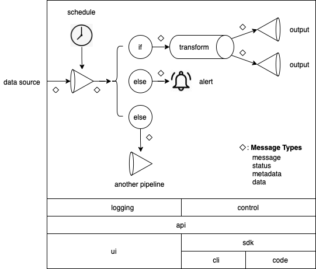

# Better ETL

## Goal

The goal is to create a specification and a sample implementation for piping and transforming data.

## Why

None of the current open source and commercial products provides the full set of features of Better ETL. 

## Features

- Language, OS and cloud agnostic
- Pluggable: a data pipeline consists of steps where each step implements a single interface. 
  This allows anyone to implement data sources, outputs, transformations, logic etc. in various languages, mix them in a single pipeline, deploy each step independently.
  All this together allows greater freedom of development, deployment and scalability.
- A pipeline is a DAG
- Each step of a pipeline runs independently. This allows continuous flow of data.
- API. Can be used to create dependencies among pipelines.
- Scheduler.
- Persistence: data coming into a pipeline step is persisted until successfully output into a next step.
- A step can output data, metadata, status, message, event. Even listener can start a DAG.
- A step that has multiple following steps can serve as a condition clause. (named outputs/connections/links)
- If a step outputs a collection, the following steps process the elements one by one (fanning out)
- Centralized logging. This allows centralized monitoring.

[Here](./etl-features.pdf) is another mosr specific list of featuers.

## Design

This diagram shows several things:

- A pipeline step can output 4 types of data:
  - status: status of the step such as success or failure.
  - data: raw data in any format.
  - metadata: description of the data, such as its format.
  - message: a message from this step for the next steps
- A condition step used for routing messages
- Examples of steps: data source, condition, transformation, output, notification, sending message to another pipeline
- Data Dagster infrastructure consists of 
  - a unified logging layer and a control module for controlling all pipelines
  - API layer on top of controller and logging. The API serves to communicate with Data Dagster.
  - UI for monitoring and controlling Data Dagster. The UI uses the API to communicate with the logging and controller.
  - SDK that uses the API to communicate with the logging and controller.
  - CLI on top of the SDK to communicate with the logging and controller.
  - Code that uses the SDK to communicate with the logging and controller.

## Roadmap

## Status

## Set up

- Install Python 3
- Run `. ./setup.sh`
